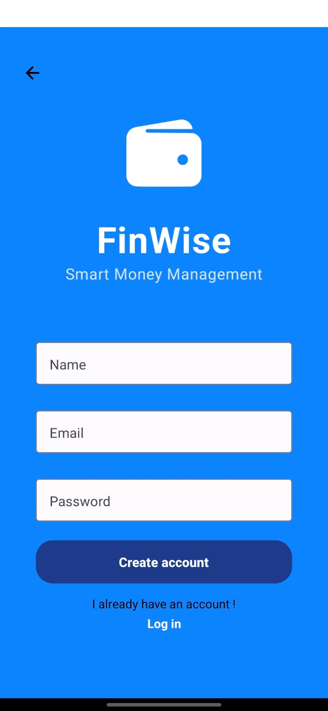
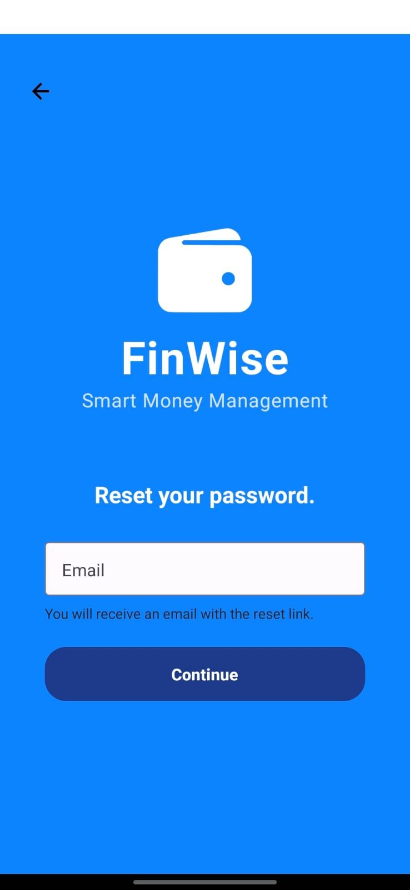
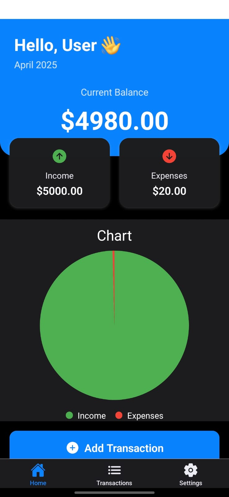
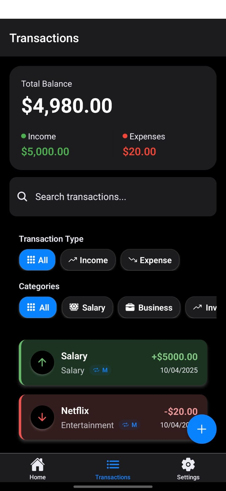
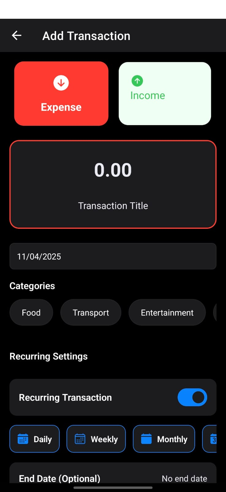
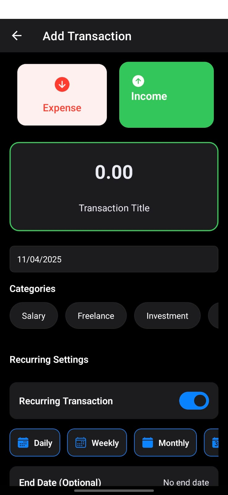

# 💰 FinWise

Um aplicativo de controle financeiro pessoal, desenvolvido com React Native (Expo). Permite ao usuário registrar, visualizar e gerenciar suas finanças de maneira simples e eficiente.

## 📱 Funcionalidades

- 📊 Dashboard com resumo financeiro
- ➕ Adição de receitas e despesas
- 📅 Filtro por data e categoria
- 🔒 Autenticação com Clerk
- 🌙 Suporte a tema escuro
- 💱 Suporte a múltiplas moedas
- 🌍 Suporte a múltiplos idiomas
- ☁️ Dados salvos na nuvem (opcional)
  
## 🖼️ Preview

| Início | Login | Cadastro | Redefinir Senha |
|-------|-------|----------|------------------|
|  |  |  |  |

| Home | Transações | Nova Despesa | Nova Receita |
|------|------------|---------------|--------------|
|  |  |  |  |

## 🚀 Tecnologias Utilizadas

- **React Native com Expo**
- **TypeScript**
- **Clerk Auth (autenticação)**
- **AsyncStorage** para persistência local
- **React Navigation**
- **Tailwind CSS (via NativeWind)**
- **Context API** para gerenciamento de estado

## 📦 Instalação

Clone o repositório e instale as dependências:

```bash
git clone https://github.com/CoutinhoGuilherme/react-native-expo-finance-tracker
cd finance-tracker
npm install
